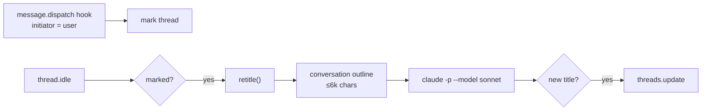

# Retitle

bb titles a thread once, from its first prompt, and never revisits it. This plugin keeps titles current. After each human message, once the turn settles, a small model reads the conversation and renames the thread if its topic has drifted. Titles name the code module the work centers on, such as `provider-codex` or `Knowledge plugin`.

## How it works



| Concern | Behavior |
| --- | --- |
| Trigger | Only turns that a human message started. Tool calls and agent- or system-initiated turns are ignored. Several messages in one turn produce one check. |
| Context | `threads.conversationOutline`, which has a 200-character preview of every message, including those from before compaction. The first user message is always kept, then the newest messages up to 6,000 characters. |
| Model | The local `claude` CLI with no tools, MCP, settings, skills, or thinking. It reuses the machine's Claude login, so no API key is needed. |
| Prompt | With no title, it writes one. Otherwise it defaults to keeping the title and renames only on a durable topic shift, a missing module name, or a cut-off title. |
| Manual renames | If the title changed since the plugin's last check, someone renamed it by hand. The plugin locks that thread and stops renaming it. `bb retitle check <id> --apply` clears the lock. |
| Races | If the title changes while the model is running, the result is dropped. |
| Skipped | Archived and hidden threads, and untitled `Continue from @thread:…` handoffs. bb shows those with the source thread's live title, so they follow its renames. Forks get their own bb title from their first prompt and are retitled like any other thread. |
| Length | Titles are capped at 45 characters. A current title over the cap always gets a fresh one. If the model goes over, the title is cut at a word boundary and trailing connectors are dropped. |

State per thread lives in the plugin's thread metadata: `{ lastTitle, locked }`.

## Cost

Measured on 16 existing threads. Costs are Claude Code's list-price estimates. With a subscription login they count against usage limits instead of being billed.

| Model | Per check | Latency | Notes |
| --- | --- | --- | --- |
| `haiku` | $0.001–0.003 | 1–3 s | Borderline threads can flip between runs. The next message retries, so a missed rename is cheap. |
| `sonnet` (default) | $0.005–0.012 | 1.3–1.5 s | More consistent, renames more readily, names modules more reliably. |

Switch with `bb plugin config retitle set model haiku`.

## Commands

```sh
bb retitle check [thread-id]          # dry run: prints what the model would do
bb retitle check [thread-id] --apply  # write it, and clear a manual-rename lock
bb retitle check [thread-id] --json
bb plugin logs retitle                # automatic checks log one line each
```

## Develop

```sh
npm install --include=dev
npm test
npx tsc -p .
bb plugin install .
```

`prompt.ts` holds the prompt and reply parsing, `retitle.ts` holds the per-thread decision, `claude.ts` holds the model call, and `server.ts` wires the hook, the idle event, and the CLI.
